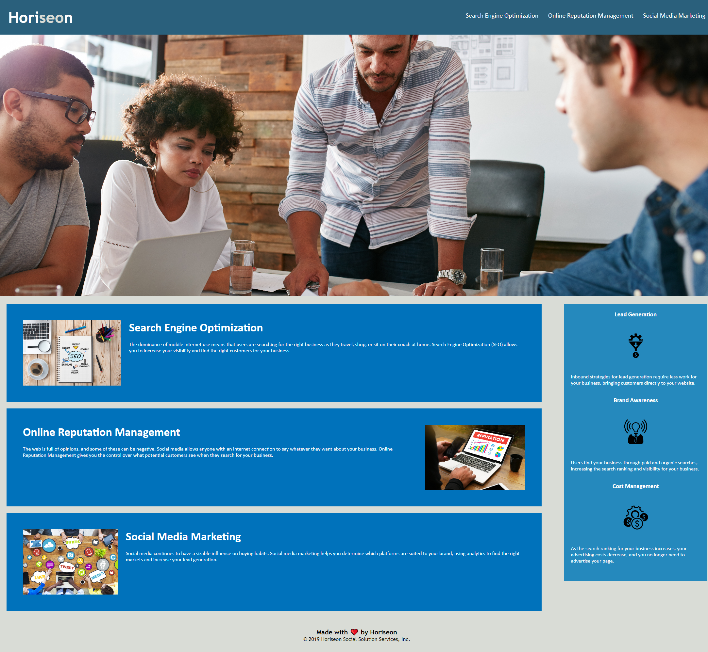

# Marketing Agency Website Refactor

## Description
This ticket was to take existing code from the client, a marketing agency website, and refactor it. The website did not meet accessibility standards which resulted in a less optimized site for search engines. 

To follow best practices for accessibility web development. There are 3 areas that have been updated
1. Semantic HTML elements have been added to the source code
2. Alt tags have been added to the images and icons on the website
3. Added a website title

These updates will help improve search engine optimization and accessibility. 

Application: https://smntsng.github.io/marketing-agency-website-refactor/

## Installation
N/A

## Usage
N/A
## Credits
N/A

## License

